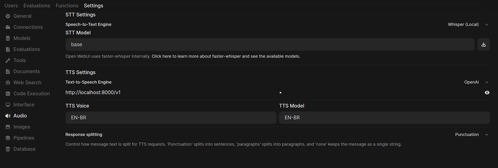

# MeloTTS-API

A simple, robust, and OpenAI-compatible FastAPI wrapper for the [MyShell-AI/MeloTTS](https://github.com/myshell-ai/MeloTTS) text-to-speech engine.

This project provides an easy-to-use HTTP interface for MeloTTS, allowing you to integrate high-quality, natural-sounding text-to-speech into your applications with simple API calls. The API structure is designed to mimic common TTS services for easy integration.

## Features

-   **High-Quality TTS:** Leverages the power of MeloTTS for fast and natural-sounding speech synthesis.
-   **OpenAI-Compatible Endpoint:** Includes a `/v1/audio/speech` endpoint that mirrors the structure of OpenAI's TTS API for drop-in compatibility with tools like Open WebUI.
-   **RESTful Interface:** Provides clear endpoints to list available models and voices.
-   **Reliable Installation:** A comprehensive `requirements.txt` file ensures a clean and complete installation in an isolated environment.
-   **CPU Ready:** Configured to run on CPU out-of-the-box, no GPU required.

---

## 🚀 Installation

For a reliable setup, please follow these steps exactly. This guide has been tested on Debian-based systems like Linux Mint 20 and Ubuntu 24.04.

### 📋 Step 1: System Prerequisites

#### For a barebones system, you will need to install Git and Python's core tools first.

```bash
sudo apt update && sudo apt upgrade -y
sudo apt install git python3 python3-pip python3-venv -y
```
### 📦 Step 2: Clone This Repository


git clone [https://github.com/highfillgoods/MeloTTS-API-Locally.git](https://github.com/highfillgoods/MeloTTS-API-Locally.git)
cd MeloTTS-API-Locally
🌿 Step 3: Create and Activate a Virtual Environment
#### Using a dedicated environment helps prevent conflicts. Choose one of the following options.

## Option A: Using conda

conda create --name melo_api_env python=3.11 -y
conda activate melo_api_env
## Option B: Using venv (Standard Python)

python3 -m venv venv
source venv/bin/activate

### 🐍 Step 4: Install Python Dependencies
#### This single command installs all necessary Python packages from the perfected requirements.txt file.


pip install -r requirements.txt
### 🧠 Step 5: Download NLTK Language Models
#### The text processor requires data packages from the NLTK library. This command downloads the necessary models.

python3 -m nltk.downloader averaged_perceptron_tagger punkt
# ▶️ Running the API Server
#### Once the installation is complete, start the API server with Uvicorn.

```bash
uvicorn melotts_api:app --host 0.0.0.0 --port 8000
```
The server will start, load the MeloTTS model, and become available at http://0.0.0.0:8000.


###  🔌 Connecting to Open WebUI
This API is designed to work directly with Open WebUI.




In Open WebUI, navigate to Settings > Audio.
Configure the TTS Settings section with the following values:
Text-to-Speech Engine: OpenAI
OpenAI API Base URL: http://localhost:8000/v1
OpenAI API Key: Can be set to anything (e.g., 12345).
Your settings should look like this:

### 🛠️ Direct API Usage (Advanced)
You can also interact with the API directly using tools like curl.

#### List Available Models
curl http://localhost:8000/v1/models

#### List Available Voices
curl http://localhost:8000/v1/audio/voices
Synthesize Speech

#### Test audio Generation of voices
```bash
curl -X POST \
  http://localhost:8000/v1/audio/speech \
  -H "Content-Type: application/json" \
  --data '{
    "input": "Hello, this is a test from the land down under.",
    "voice": "EN-AU"
  }' \
  --output test_audio.mp3
```

## Bonus: Running the Original MeloTTS WebUI
These instructions are for running the original Gradio WebUI developed by MyShell-AI, which is separate from the FastAPI server above. It's recommended to do this in a different folder and a new, clean environment.

Clone the Original MeloTTS Repository


### Make sure you are in your home directory or outside your API project folder
git clone [https://github.com/myshell-ai/MeloTTS.git](https://github.com/myshell-ai/MeloTTS.git)
cd MeloTTS
Create a Separate, Clean Environment (e.g., conda create --name melo_ui_env python=3.11 -y) and activate it.

#### Install All WebUI Dependencies. Note: We do not use pip install melo.


pip install torch torchvision torchaudio gradio librosa tqdm transformers cn2an pypinyin jieba eng_to_ipa inflect unidecode num2words pykakasi fugashi g2p_en anyascii jamo gruut cached_path unidic


python3 -m nltk.downloader averaged_perceptron_tagger punkt
python3 -m melo.app

## Open in browser for Original MeloTTS WebUI
http://localhost:7860


